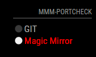

# MMM-portcheck
Port Checker Module for MagicMirror<sup>2</sup>
Based on MMM-Ping(https://github.com/fewieden/MMM-ping) by fewieden



## Dependencies
  * An installation of [MagicMirror<sup>2</sup>](https://github.com/MichMich/MagicMirror)
  * npm
  * [tcp-ping](https://www.npmjs.com/package/tcp-ping)

## Installation
 1. Clone this repo into `~/MagicMirror/modules` directory.
 2. Configure your `~/MagicMirror/config/config.js`:

    ```
    {
        module: 'MMM-portcheck',
        position: 'bottom_right',
        config: {
            hosts: [
                ['www.github.com','80','GitHub'],
                ['forum.magicmirror.builders','80','MagicMirror Forum']
            ],
			font: 'small',
			updateInterval: 5,
			colored: true, 
			display: 'both',
			alert: true,
			alertTime: 15,
			textAlign: 'left'
        }
    },
    ```
 3. Run command `npm install` in `~/MagicMirror/modules/MMM-portcheck` directory.

## Config Options
| **Option** | **Default** | **Description** |
| --- | --- | --- |
| `colored` | false | show badge in color or not |
| `display` | 'both' | what should be displayed 'online', 'offline' or 'both' |
| `hosts` | [['www.github.com','80','GitHub],['forum.magicmirror.builders','80','MagicMirror Forum']] | [<hostname>,<port>,<name>] |
| `updateInterval` | 5 | how often the module should ping the hosts in minutes |
| `font` | 'medium' | font size 'xsmall', 'small', 'medium', 'large' or 'xlarge' |
| `alert` | true | show an alert message when at least one host don't response
| `alertTime` | 15 | time to show the alert message, in seconds
| `textAlign` | 'left' | text align on the container

